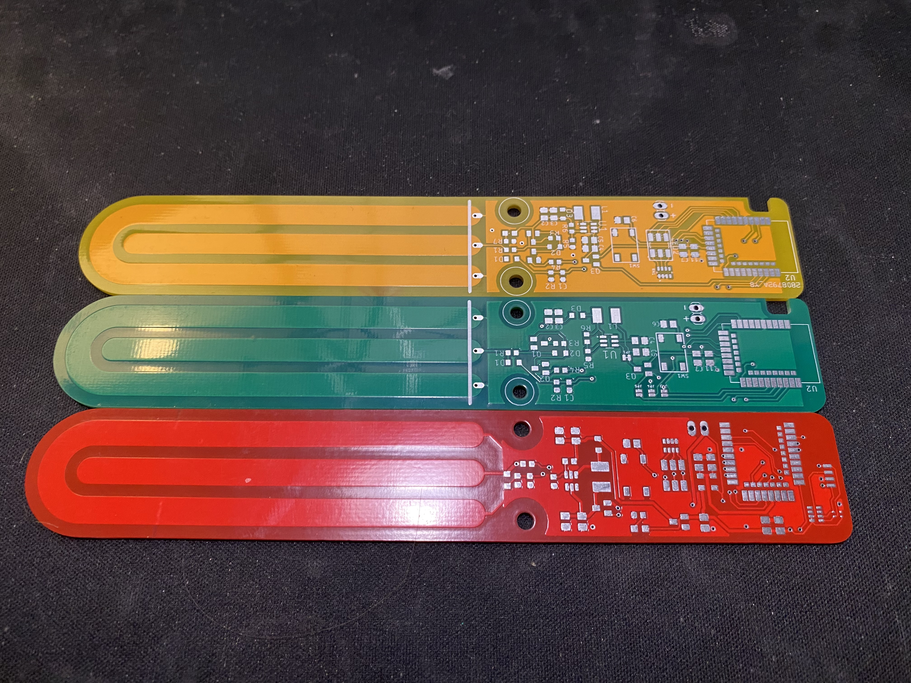
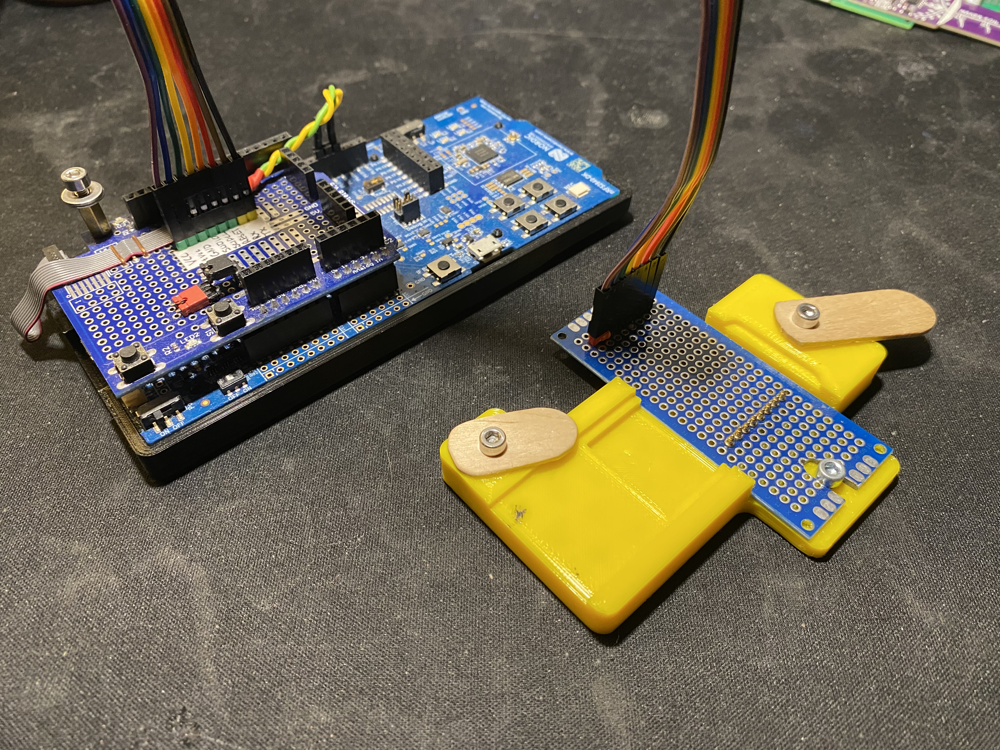
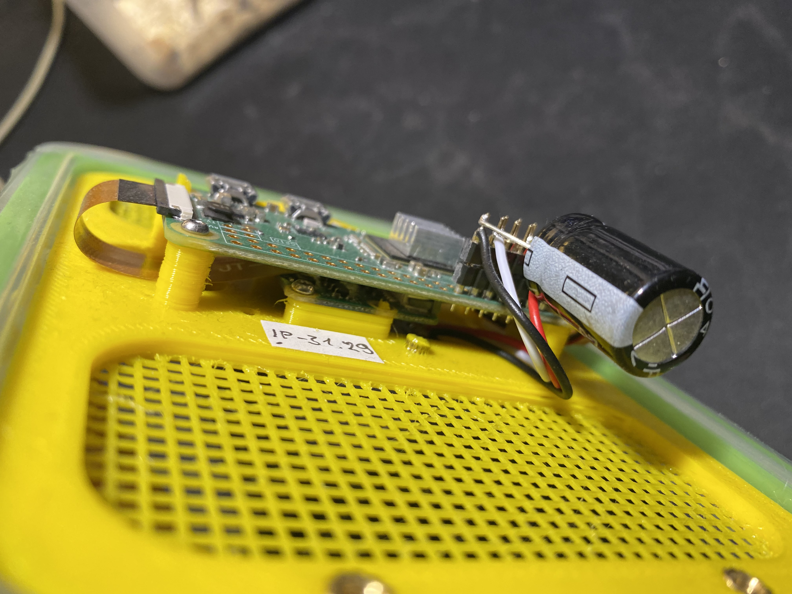

#### Hi, I'm Stefan Tobiasiewicz and this is a short description of some of my projects that I have done in the last two years

## Soil Sensor:

The device is designed to monitor soil moisture levels in plants. The project is ultimately based on
the NRF52833 SoC, whereas the previous version used the NRF52811. The device use a capacitive
soil sensor, and during development, my own design for this type of sensor was created. The NRF52833
SoC is chosen for future integration into Zigbee networks. Currently, the device utilizes BLE for
transmitting data to software. In addition, I developed a Python application for this project, which
listens to advertisements from devices and pushes the data to an MQTT broker.

The device is powered by two AAA batteries, and all versions were programmed using the nRF Connect
SDK. The latest version of the PCB includes additional sensors for light, humidity, and temperature.
However, this version has not been assembled yet.

Github link: https://github.com/stefantobiasiewicz/soil-moisture/tree/nrf52833-V2.0.1

Software for receiving data form sensor:
Github link: https://github.com/stefantobiasiewicz/bleConnectV2

Looks of designed PCB

Programmer and programming station (bottom pads match proggramer pins in 3d printed case):

Current final working PCB

## Bug Box:

Project for monitoring the bug breeding process (bugs is gecko food). The project is based on
Raspberry Pi Zero, and the main application is written in Python. The device is equipped with a
camera, temperature sensor, and humidity sensor. It captures an image every 15 minutes and reports
environmental data. The deployment process is managed through bash scripts, executed on a single
Raspberry Pi to deploy new versions of the application. All data is sent to a blob storage Minio,
which is running on another server machine.

Github link: https://github.com/stefantobiasiewicz/bug-box

## Water dispenser:

The project is designed for watering plants and is based on the NRF52820 SoC, programmed using the
nRF Connect SDK. The device utilizes BLE for interaction with the user. Additionally, a Python
application was created for the project to control it.

The device use a relay valve and a water flow sensor, enabling precise dispensing of water. To
power up the relay and the main board, a 230V-12V AC-DC converter is used.

Github link: https://github.com/stefantobiasiewicz/water-dispenser

## Contact Sensor:

The project I completed to fulfill the requirements for my Bachelor's degree in Engineering involved
creating a device to function as a door/window open-close sensor in a Zigbee network. The device
seamlessly integrates with the Zigbee2Mqtt platform and Home Assistant software. It is built around
the NRF52840 SoC from Nordic Semiconductor, and the software was developed using the nRF5 SDK for
Thread and Zigbee.

I designed the PCB, which was then ordered from a factory. The assembly process involved
soldering using solder paste and a homemade hotplate, along with an iron.

Github link: https://github.com/stefantobiasiewicz/Inzynierka

Also I designed cover and print it on 3d print:

## Angle Sensor:
A device designed as an electronic angle level. The device uses the STM32F103C8 MCU and MPU6050 to monitor angle and acceleration.
Based on these parameters, the total angle where the device is placed is calculated. The device is powered by a 3.7V li-poly battery with an onboard charger.
For the device, my own PCB design was created and manufactured. Everything was soldered by me using a hotplate and soldering iron. 
For software development, I used STM-Cube-MX and my own designed MPU6050 I2C library based on the datasheet.

## Gecko Controller:

The project is designed for controlling a gecko terrarium. The device manages a heater plate beneath
the pet's sleeping area and controls the lighting within the terrarium. It is built around the
ESP-12F microcontroller and exposes a REST API for user control.

## Gecko Heater:

The project is designed to regulate the air temperature in a gecko terrarium, functioning similarly
to a hairdryer. A fan directs air over a heat spiral made from resistance wire. The entire device is
built on the Atmega8 microcontroller, utilizing the serial port for control. I implemented an AT
command protocol parser over the serial port, which I designed myself. The device is powered by a
12V external power supply.

