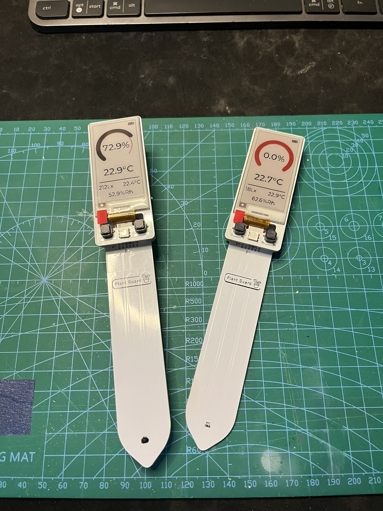
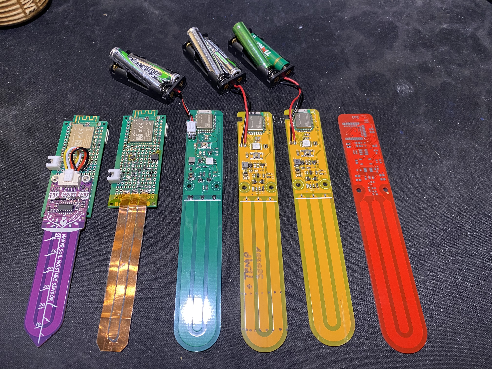

#### Hi, I'm Stefan Tobiasiewicz and this is a short description of some of my projects that I have done and I want to share

## Guitar Pickup Coil Winder

This project is a CNC-based winding machine designed for guitar pickup coils, featuring custom G-code interpretation, a CAM G-code generator, and visualization software. Developed over the course of a year, it provides precise control over coil winding for improved sound quality.

### Machine Overview

The core of the machine is built around an STM32 microcontroller, equipped with all the necessary electronics for controlling stepper motors, an onboard display, and a USB keyboard interface. The hardware is currently based on a CNC shield with motor drivers, along with custom prototype boards for additional electronic components.

The machine operates in two modes:
- **Standalone Mode** – Allows simple coil winding without external control.
- **PC-Controlled Mode** – Enables more advanced and repeatable coil winding patterns using a G-code protocol, allowing greater customization of coil shapes, which directly influences the guitar's sound characteristics.

The embedded software is written in C, utilizing a complex state-machine approach with multithreading for efficient task management. Advanced algorithms ensure precise stepper motor control and accurate position interpolation.

### PC Software

The PC interface is built using Python and Qt, consisting of two main applications:

#### G-code Generator

A custom G-code generator for modeling coil shapes. It currently supports two deterministic algorithms to create coil patterns and visualizes them as color plots, providing an initial preview of the coil structure.

#### G-code Sender & Machine Control

A dedicated G-code sender application allows for direct machine control via a serial port interface. It includes:
- Serial port selection
- Real-time program status monitoring

### Current Development Status

The machine is in an advanced development stage, providing stable and reliable operation for coil production. Ongoing improvements continue to enhance its functionality and usability.

[//]: # (Insert images of the winder and software in action)

## Soil Sensor:

The device is designed to monitor soil moisture levels in plants. The project is ultimately based on
the NRF52833/NRF52840 SoC, whereas the previous version used the NRF52811. The device use a capacitive
soil sensor, and during development, my own design for this type of sensor was created. 

Current state of development/features:
* Device have operational two color E-ink screen
* two buttons and led for device control
* Powered by two AAA batteries
* Capacitive soil sensor with ground temperature sensor
* Light sensor (VEML7700)
* Temperature and humidity sensor (SHT40)
* BLE for custom advertise protocol 
* Zigbee networking with custom Zigbee2Mqtt extension

Softwrare:
Base on program developed with C and nrf-connect-SDK with Zephyr RTOS. 
UI is created in LVGL with custom zephyr display driver constructed for two colour pxiel e-ink display.

The device is powered by two AAA batteries and designed to minimize current consumption.
To achieve this, a dedicated power management solution was developed, with software optimized 
for deep sleep and control over enabling and disabling peripherals as needed.
Additionally, custom steering of SPI driver were made to workaround the Zephyr driver to deactivate pins, 
further reducing energy consumption.

Currently device can work with Zigbee2Mqtt software and can be use in home automation
software like Home Assistant 

Github link: https://github.com/stefantobiasiewicz/soil-moisture/tree/v6

Software for receiving data form sensor:
Github link: https://github.com/stefantobiasiewicz/bleConnectV2

### Prototypes

Programmer and programming station (bottom pads match proggramer pins in 3d printed case):

Current final working PCB

## Bug Box:

Project for monitoring the bug breeding process (bugs is gecko food). The project is based on
Raspberry Pi Zero, and the main application is written in Python. The device is equipped with a
camera, temperature sensor, and humidity sensor. It captures an image every 15 minutes and reports
environmental data. The deployment process is managed through bash scripts, executed on a single
Raspberry Pi to deploy new versions of the application. All data is sent to a blob storage Minio,
which is running on another server machine.

Github link: https://github.com/stefantobiasiewicz/bug-box

## Water dispenser:

The project is designed for watering plants and is based on the NRF52820 SoC, programmed using the
nRF Connect SDK. The device utilizes BLE for interaction with the user. Additionally, a Python
application was created for the project to control it.

The device use a relay valve and a water flow sensor, enabling precise dispensing of water. To
power up the relay and the main board, a 230V-12V AC-DC converter is used.

Github link: https://github.com/stefantobiasiewicz/water-dispenser

## Contact Sensor:

The project I completed to fulfill the requirements for my Bachelor's degree in Engineering involved
creating a device to function as a door/window open-close sensor in a Zigbee network. The device
seamlessly integrates with the Zigbee2Mqtt platform and Home Assistant software. It is built around
the NRF52840 SoC from Nordic Semiconductor, and the software was developed using the nRF5 SDK for
Thread and Zigbee.

I designed the PCB, which was then ordered from a factory. The assembly process involved
soldering using solder paste and a homemade hotplate, along with an iron.

Github link: https://github.com/stefantobiasiewicz/Inzynierka

Also I designed cover and print it on 3d print:

## Angle Sensor:
A device designed as an electronic angle level. The device uses the STM32F103C8 MCU and MPU6050 to monitor angle and acceleration.
Based on these parameters, the total angle where the device is placed is calculated. The device is powered by a 3.7V li-poly battery with an onboard charger.
For the device, my own PCB design was created and manufactured. Everything was soldered by me using a hotplate and soldering iron. 
For software development, I used STM-Cube-MX and my own designed MPU6050 I2C library based on the datasheet.

## Gecko Controller:

The project is designed for controlling a gecko terrarium. The device manages a heater plate beneath
the pet's sleeping area and controls the lighting within the terrarium. It is built around the
ESP-12F microcontroller and exposes a REST API for user control.

## Gecko Heater:

The project is designed to regulate the air temperature in a gecko terrarium, functioning similarly
to a hairdryer. A fan directs air over a heat spiral made from resistance wire. The entire device is
built on the Atmega8 microcontroller, utilizing the serial port for control. I implemented an AT
command protocol parser over the serial port, which I designed myself. The device is powered by a
12V external power supply.

